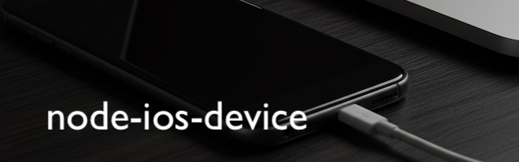

<br>
<div align="center">
	
</div>
<br>

Queries connected iOS devices, installs apps, and relays log output.

## Installation

    npm install node-ios-device

## CLI

```
$ node-ios-device

USAGE: node-ios-device <command> [options]

COMMANDS:
  forward               Connects to a port on an device and relays messages
  i, install            Install an app on the specified device
  ls, list, devices     Lists connected devices
  watch, track-devices  Listens for devices to be connected/disconnected
```

## Example

```js
import iosDevice from 'node-ios-device';

// get all connected iOS devices
const devices = iosDevice.list();
console.log('Connected devices:', devices);

// continuously watch for devices to be connected or disconnected
const handle = iosDevice.watch();
handle.on('change', devices => {
    console.log('Connected devices:', devices);
});
handle.on('error', console.error);

// install an iOS app
iosDevice.install('<device udid>', '/path/to/my.app');

// relay output from a TCP port created by an iOS app
iosDevice
    .forward('<device udid>', 1337)
    .on('data', console.log)
    .on('end', () => console.log('Device disconnected'));
```

## API

### `list()`

Retrieves an array of all connected iOS devices.

Returns an `Array` of device objects.

Device objects contain the following information:

* `udid` - The device's unique device id (e.g. "a4cbe14c0441a2bf87f397602653a4ac71eb0336")
* `name` - The name of the device (e.g. "My iPhone")
* `buildVersion` - The build version (e.g. "10B350")
* `cpuArchitecture` - The CPU architecture (e.g. "armv7s")
* `deviceClass` - The type of device (e.g. "iPhone", "iPad")
* `deviceColor` - The color of the device (e.g. "Black", "White")
* `hardwareModel` - The device module (e.g. "[N41AP](http://theiphonewiki.com/wiki/N41ap)")
* `modelNumber` - The model number (e.g. "MD636")
* `productType` - The product type or model id (e.g. "iPhone5,1")
* `productVersion` - The iOS version (e.g. "6.1.4")
* `serialNumber` - The device serial number (e.g. "XXXXXXXXXXXX")

There is more data that could have been retrieved from the device, but the properties above seemed
the most reasonable.

### `watch()`

Continuously retrieves an array of all connected iOS devices. Whenever a device is connected or
disconnected, the `'change'` event is emitted.

Returns an `EventEmitter`-based `Handle` instance that contains a `stop()` method to discontinue
tracking devices.

#### Event: `'change'`

Emitted when a device is connected or disconnected.

- `{Array<Object>} devices` - An array of devices

#### Example:

```js
const handle = iosDevice.watch()
    .on('change', console.log);

setTimeout(() => {
    // turn off tracking after 1 minute
    handle.stop();
}, 60000);
```

### `install(udid, appPath)`

Installs an iOS app on the specified device.

* `{String} udid` - The device udid
* `{String} appPath` - The path to the iOS .app

Currently, an `appPath` that begins with `~` is not supported.

The `appPath` must resolve to an iOS .app, not the .ipa file.

### `forward(udid, port)`

Relays messages from a server running on the device on the specified port.

* `{String} udid` - The device udid
* `{String} port` - The TCP port listening in the iOS app to connect to

Returns a `Handle` instance that contains a `stop()` method to discontinue
emitting messages.

> NOTE: `forward()` only supports USB connected devices. Wi-Fi-only connected devices will not work.

#### Event: `'data'`

Emitted for each line of output. Empty lines are omitted.

- `{String} message` - The log message.

#### Event: 'end'

Emitted when the device is physically disconnected. Note that this does not unregister the internal
callback. You must manually call `handle.stop()` to cleanup.

#### Example:

```js
const handle = iosDevice
	.forward('<device udid>', 1337)
    .on('log', console.log)
    .on('end', () => console.log('End of forward'));

setTimeout(function () {
	// turn off logging after 1 minute
	handle.stop();
}, 60000);
```

## Advanced

### Debug Logging

`node-ios-device` exposes an event emitter that emits debug log messages. This is intended to help
debug issues under the hood. The average user will never need to use this, however it would be
handy when filing a bug.

```js
iosDevice.on('log', msg => console.log(msg));
```

Alternatively, `node-ios-device` uses the amazing [snooplogg](https://www.npmjs.com/package/snooplogg) debug logger where you simply
set the `SNOOPLOGG` environment variable to `node-ios-device` (or `*`) and it will print the debug
log to stdout.

## Contributing

Interested in contributing? There are several ways you can help contribute to this project.

### New Features, Improvements, Bug Fixes, & Documentation

Source code contributions are always welcome! Before we can accept your pull request, you must sign a Contributor License Agreement (CLA). Please visit https://tidev.io/contribute for more information.

### Donations

Please consider supporting this project by making a charitable [donation](https://tidev.io/donate). The money you donate goes to compensate the skilled engineeers and maintainers that keep this project going.

### Code of Conduct

TiDev wants to provide a safe and welcoming community for everyone to participate. Please see our [Code of Conduct](https://tidev.io/code-of-conduct) that applies to all contributors.

## Security

If you find a security related issue, please send an email to [security@tidev.io](mailto:security@tidev.io) instead of publicly creating a ticket.

## Stay Connected

For the latest information, please find us on X: [Titanium SDK](https://x.com/titaniumsdk) and [TiDev](https://x.com/tidevio).

Join our growing Slack community by visiting https://slack.tidev.io!
